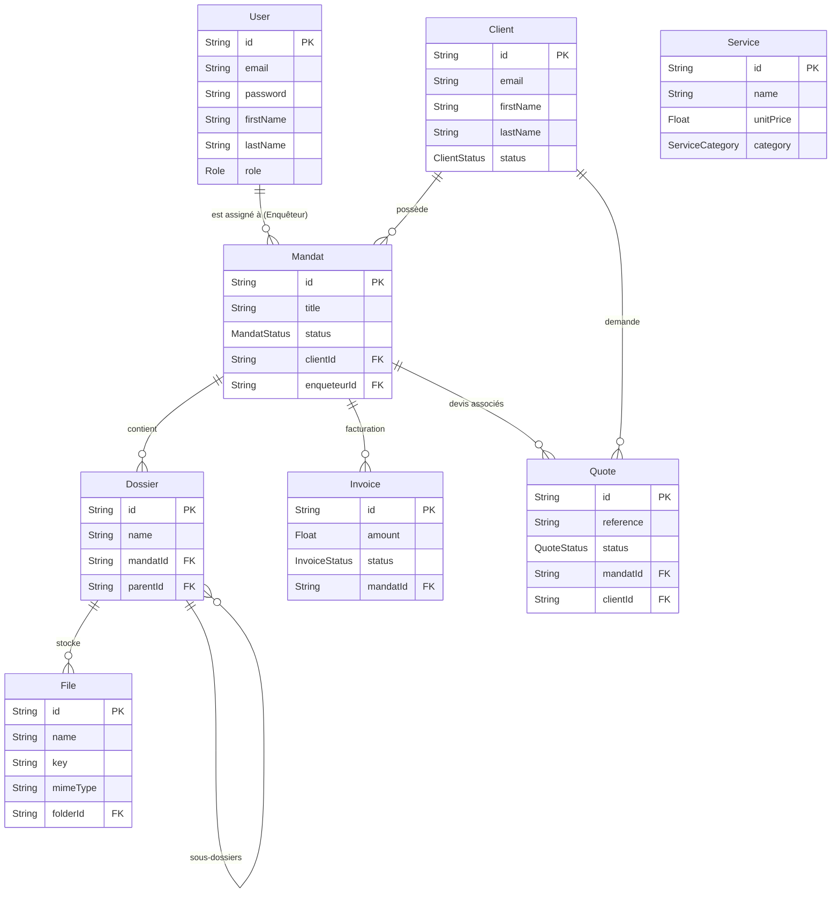

# Modèle de données (ERD)

Ce document présente l'architecture de la base de données du CRM DigitalDetectives, généré à partir du schéma Prisma.

## Diagramme Entité-Relation (ERD)

## Description des Entités Principales

### `User` (Utilisateurs internes)
Représente les employés du cabinet (Administrateurs, Enquêteurs) ainsi que les Sous-traitants. Gère l'authentification (Mots de passe, 2FA) et les droits d'accès via l'attribut `Role`.

### `Client`
Les clients de l'agence. Peuvent être des prospects (`PROSPECT`) ou des clients actifs (`ACTIF`). Un client peut être rattaché à plusieurs mandats et avoir plusieurs devis ou factures.

### `Mandat`
Le cœur du CRM. Représente une enquête ou une mission confiée par un `Client` et assignée à un `User` (Enquêteur). Possède un statut (`OUVERT`, `EN_COURS`, `TERMINE`, etc.) et sert de point d'ancrage pour les factures, devis, fichiers et sous-traitants.

### `Dossier` & `File`
Gestion documentaire par mandat. Les dossiers peuvent être imbriqués (hiérarchie via `parentId`). `File` représente les preuves (photos, vidéos, rapports) stockées sur S3/Infomaniak, incluant les métadonnées géographiques et EXIF (pour les photos Nikon, par exemple).

### `Quote` (Devis) & `Service` (Catalogue)
Permet de chiffrer une mission avant de la démarrer. `Quote` est constitué de plusieurs `QuoteItem` (non affichés dans l'ERD simplifié), qui se basent sur les tarifs standardisés du catalogue `Service`.

### `Invoice` (Factures)
Représente un paiement dû par un client pour un mandat. Géré via Stripe (Payment Intent / Checkout Session). Intègre un suivi automatique des relances grâce à l'échéance (`dueDate`).
