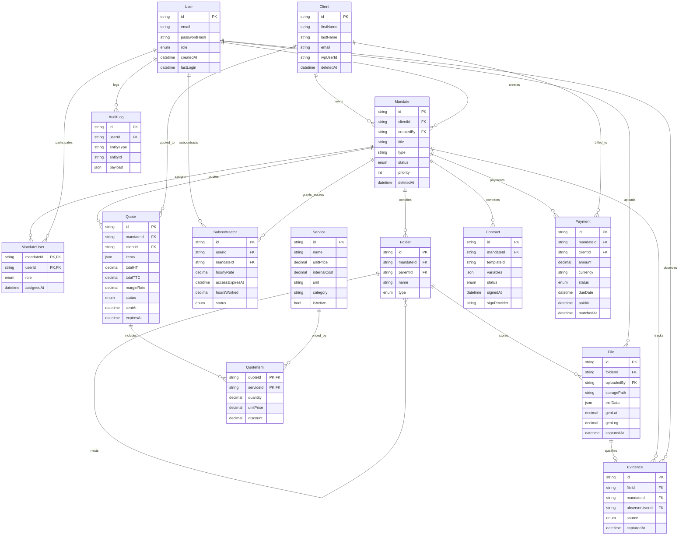

# ERD - CRM DigitalDetectives

Mise a jour du modele relationnel apres ajout des entites de gestion documentaire, preuves, sous-traitance et cycle financier.

## Notes de modelisation

- exifData est stocke en JSONB (champ Prisma Json) pour conserver les metadonnees brutes.
- accessExpiresAt est obligatoire sur Subcontractor.
- Index mandateId ajoutes sur Folder, Evidence et Subcontractor.
- items est stocke en JSONB sur Quote pour snapshotter les prestations au moment de la generation.
- Index dashboard finance: mandateId et status sur Quote/Contract/Payment, plus dueDate sur Payment.
