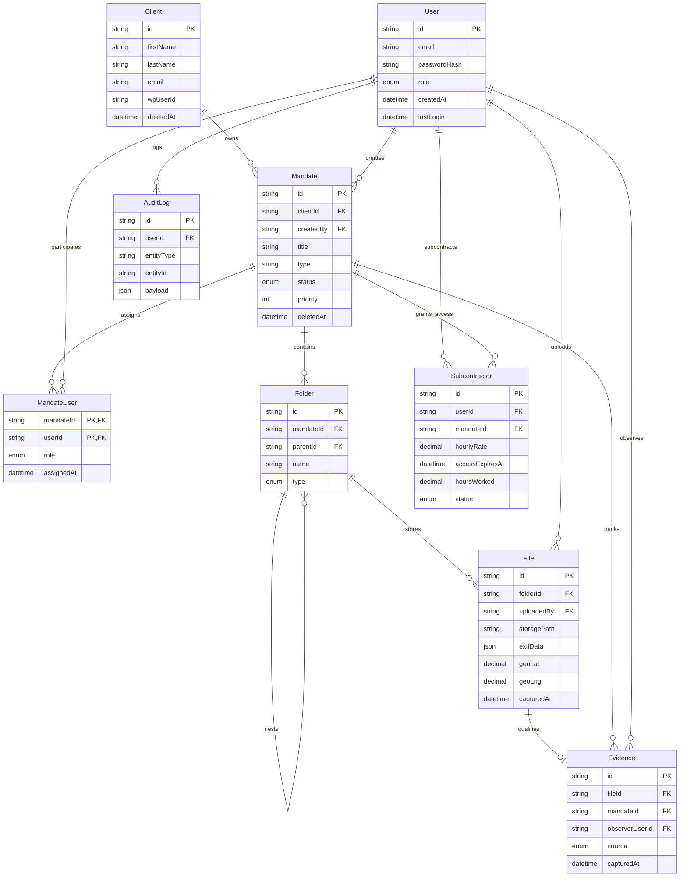

# ERD - CRM DigitalDetectives

Mise a jour du modele relationnel apres ajout des entites de gestion documentaire, preuves et sous-traitance.

## Notes de modelisation

- exifData est stocke en JSONB (champ Prisma Json) pour conserver les metadonnees brutes.
- accessExpiresAt est obligatoire sur Subcontractor.
- Index mandateId ajoutes sur Folder, Evidence et Subcontractor.
