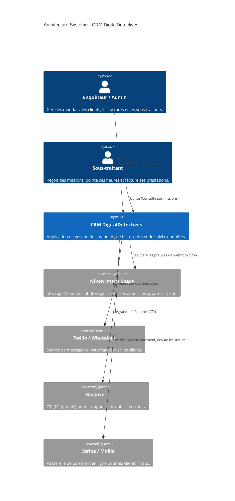
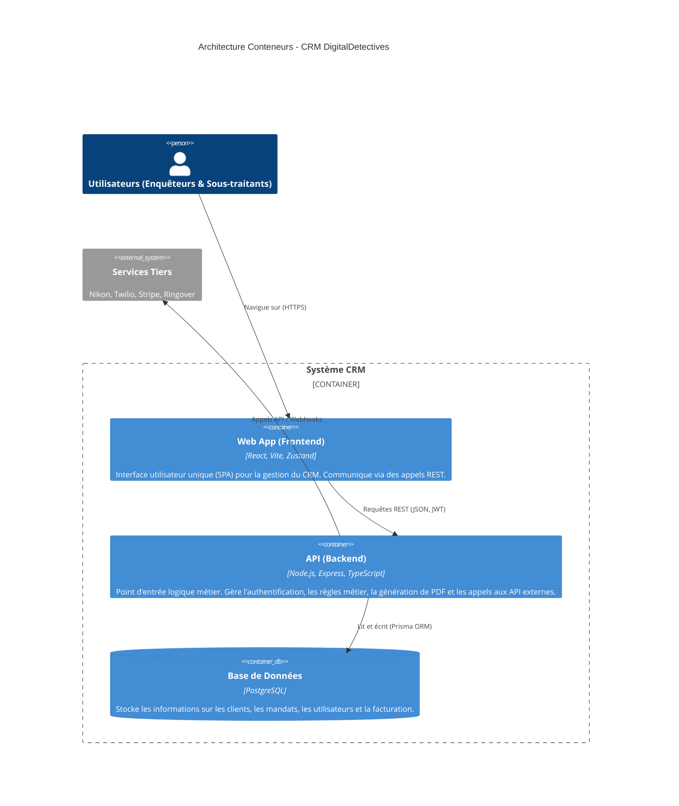
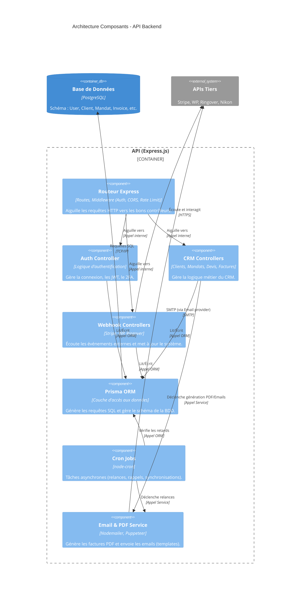

# Architecture C4 (Niveau 1 et 2)

## 1. Contexte Système (Niveau 1)

Ce diagramme montre le CRM DigitalDetectives dans son environnement, avec les utilisateurs et les systèmes externes avec lesquels il interagit.

## 2. Conteneurs (Niveau 2)

Ce diagramme détaille l'intérieur du système CRM, montrant l'application Web Frontend, l'API Backend et la Base de données.

## 3. Composants (Niveau 3 - Backend API)

Ce diagramme illustre les composants internes clés de l'API (Backend Node.js/Express) et leurs interactions.

